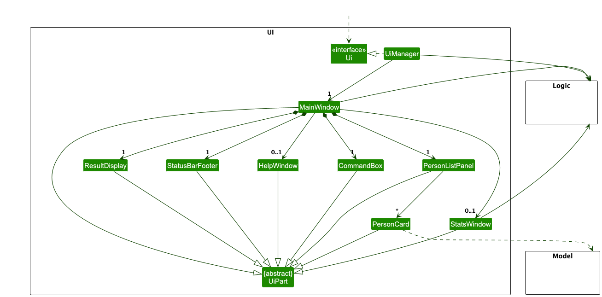
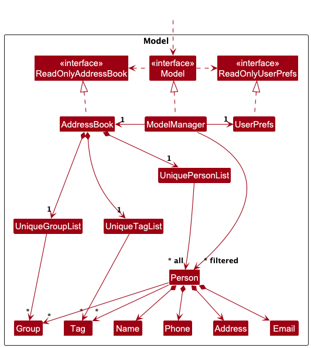
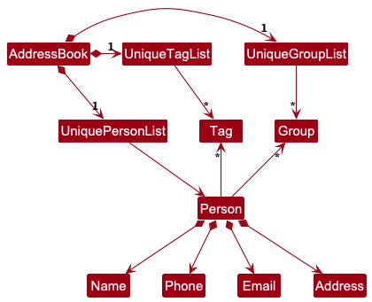
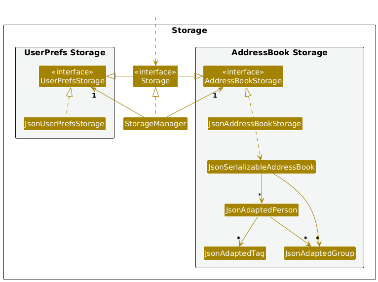

* Table of Contents
{:toc}

--------------------------------------------------------------------------------------------------------------------

## **Acknowledgements**

* Libraries used:
    * [JavaFX](https://openjfx.io/) - GUI framework for building the user interface
    * [JUnit5](https://junit.org/junit5/) - Unit testing framework for comprehensive test coverage
* Build and development tools:
    * [Gradle](https://gradle.org/) - Build automation and dependency management
* Documentation:
    * [Jekyll](https://jekyllrb.com/) - Static site generator for project documentation
    * [PlantUML](https://plantuml.com/) - Automatic generation of UML diagrams from text descriptions.

--------------------------------------------------------------------------------------------------------------------

## **Setting up, getting started**

Refer to the guide [_Setting up and getting started_](SettingUp.md).

--------------------------------------------------------------------------------------------------------------------

## **Design**

:bulb: **Tip:** The `.puml` files used to create diagrams are in this document `docs/diagrams` folder. Refer to the [_PlantUML Tutorial_ at se-edu/guides](https://se-education.org/guides/tutorials/plantUml.html) to learn how to create and edit diagrams.

### Architecture

The ***Architecture Diagram*** given above explains the high-level design of the App.

Given below is a quick overview of main components and how they interact with each other.

**Main components of the architecture**

**`Main`** (consisting of classes [`Main`](https://github.com/se-edu/addressbook-level3/tree/master/src/main/java/seedu/address/Main.java) and [`MainApp`](https://github.com/se-edu/addressbook-level3/tree/master/src/main/java/seedu/address/MainApp.java)) is in charge of the app launch and shut down.
* At app launch, it initializes the other components in the correct sequence, and connects them up with each other.
* At shut down, it shuts down the other components and invokes cleanup methods where necessary.

The bulk of the app's work is done by the following four components:

* [**`UI`**](#ui-component): The UI of the App.
* [**`Logic`**](#logic-component): The command executor.
* [**`Model`**](#model-component): Holds the data of the App in memory.
* [**`Storage`**](#storage-component): Reads data from, and writes data to, the hard disk.

[**`Commons`**](#common-classes) represents a collection of classes used by multiple other components.

**How the architecture components interact with each other**

The *Sequence Diagram* below shows how the components interact with each other for the scenario where the user issues the command `delete 1`.

Each of the four main components (also shown in the diagram above),

* defines its *API* in an `interface` with the same name as the Component.
* implements its functionality using a concrete `{Component Name}Manager` class (which follows the corresponding API `interface` mentioned in the previous point.

For example, the `Logic` component defines its API in the `Logic.java` interface and implements its functionality using the `LogicManager.java` class which follows the `Logic` interface. Other components interact with a given component through its interface rather than the concrete class (reason: to prevent outside component's being coupled to the implementation of a component), as illustrated in the (partial) class diagram below.

The sections below give more details of each component.

### UI component

The **API** of this component is specified in [`Ui.java`](https://github.com/se-edu/addressbook-level3/tree/master/src/main/java/seedu/address/ui/Ui.java)

The UI consists of a `MainWindow` that is made up of parts e.g.`CommandBox`, `ResultDisplay`, `PersonListPanel`, `StatusBarFooter` etc. All these, including the `MainWindow`, inherit from the abstract `UiPart` class which captures the commonalities between classes that represent parts of the visible GUI.

The `UI` component uses the JavaFx UI framework. The layout of these UI parts are defined in matching `.fxml` files that are in the `src/main/resources/view` folder. For example, the layout of the [`MainWindow`](https://github.com/se-edu/addressbook-level3/tree/master/src/main/java/seedu/address/ui/MainWindow.java) is specified in [`MainWindow.fxml`](https://github.com/se-edu/addressbook-level3/tree/master/src/main/resources/view/MainWindow.fxml)

The `UI` component,

* executes user commands using the `Logic` component.
* listens for changes to `Model` data so that the UI can be updated with the modified data.
* keeps a reference to the `Logic` component, because the `UI` relies on the `Logic` to execute commands.
* depends on some classes in the `Model` component, as it displays `Person` object residing in the `Model`.

### Logic component

**API** : [`Logic.java`](https://github.com/se-edu/addressbook-level3/tree/master/src/main/java/seedu/address/logic/Logic.java)

Here's a (partial) class diagram of the `Logic` component:

The sequence diagram below illustrates the interactions within the `Logic` component, taking `execute("delete 1")` API call as an example.

:information_source: **Note:** The lifeline for `DeleteCommandParser` should end at the destroy marker (X) but due to a limitation of PlantUML, the lifeline continues till the end of diagram.

How the `Logic` component works:

1. When `Logic` is called upon to execute a command, it is passed to an `AddressBookParser` object which in turn creates a parser that matches the command (e.g., `DeleteCommandParser`) and uses it to parse the command.
1. This results in a `Command` object (more precisely, an object of one of its subclasses e.g., `DeleteCommand`) which is executed by the `LogicManager`.
1. The command can communicate with the `Model` when it is executed (e.g. to delete a person). 
   Note that although this is shown as a single step in the diagram above (for simplicity), in the code it can take several interactions (between the command object and the `Model`) to achieve.
1. The result of the command execution is encapsulated as a `CommandResult` object which is returned back from `Logic`.

Here are the other classes in `Logic` (omitted from the class diagram above) that are used for parsing a user command:

How the parsing works:
* When called upon to parse a user command, the `AddressBookParser` class creates an `XYZCommandParser` (`XYZ` is a placeholder for the specific command name e.g., `AddCommandParser`) which uses the other classes shown above to parse the user command and create a `XYZCommand` object (e.g., `AddCommand`) which the `AddressBookParser` returns back as a `Command` object.
* All `XYZCommandParser` classes (e.g., `AddCommandParser`, `DeleteCommandParser`, ...) inherit from the `Parser` interface so that they can be treated similarly where possible e.g, during testing.

### Model component
**API** : [`Model.java`](https://github.com/se-edu/addressbook-level3/tree/master/src/main/java/seedu/address/model/Model.java)

The `Model` component,

* stores the address book data, which includes: 
  * All `Person` objects contained within a `UniquePersonList`.
  * All `Group` objects contained within a `UniqueGroupList`. 
  * All `Tag` objects contained within a `UniqueTagList`.

* stores the currently 'selected' `Person` objects (e.g., results of a search or filter command) as a separate `FilteredList<Person>`, exposed as an unmodifiable `ObservableList<Person>`.  
  This allows the UI to automatically update whenever the data in the list changes.

* stores a `UserPref` object that represents the user’s preferences. This is exposed to the outside as a `ReadOnlyUserPref` objects.
* does not depend on any of the other three components (as the `Model` represents data entities of the domain, they should make sense on their own without depending on other components)

:information_source: **Note:** An alternative (arguably, a more OOP) model is given below. It has a `Tag` list in the `AddressBook`, which `Person` references. This allows `AddressBook` to only require one `Tag` object per unique tag, instead of each `Person` needing their own `Tag` objects. 

### Storage component

**API** : [`Storage.java`](https://github.com/se-edu/addressbook-level3/tree/master/src/main/java/seedu/address/storage/Storage.java)

The `Storage` component,
* can save both address book data and user preference data in JSON format, and read them back into corresponding objects.
* inherits from both `AddressBookStorage` and `UserPrefStorage`, which means it can be treated as either one (if only the functionality of only one is needed).
* depends on some classes in the `Model` component (because the `Storage` component's job is to save/retrieve objects that belong to the `Model`)

### Common classes

Classes used by multiple components are in the `seedu.address.commons` package.

--------------------------------------------------------------------------------------------------------------------

## **Implementation**

This section describes some noteworthy details on how certain features are implemented.

### \[Proposed\] Undo/redo feature

#### Proposed Implementation

The proposed undo/redo mechanism is facilitated by `VersionedAddressBook`. It extends `AddressBook` with an undo/redo history, stored internally as an `addressBookStateList` and `currentStatePointer`. Additionally, it implements the following operations:

* `VersionedAddressBook#commit()` — Saves the current address book state in its history.
* `VersionedAddressBook#undo()` — Restores the previous address book state from its history.
* `VersionedAddressBook#redo()` — Restores a previously undone address book state from its history.

These operations are exposed in the `Model` interface as `Model#commitAddressBook()`, `Model#undoAddressBook()` and `Model#redoAddressBook()` respectively.

Given below is an example usage scenario and how the undo/redo mechanism behaves at each step.

Step 1. The user launches the application for the first time. The `VersionedAddressBook` will be initialized with the initial address book state, and the `currentStatePointer` pointing to that single address book state.

Step 2. The user executes `delete 5` command to delete the 5th person in the address book. The `delete` command calls `Model#commitAddressBook()`, causing the modified state of the address book after the `delete 5` command executes to be saved in the `addressBookStateList`, and the `currentStatePointer` is shifted to the newly inserted address book state.

Step 3. The user executes `add n/David …​` to add a new person. The `add` command also calls `Model#commitAddressBook()`, causing another modified address book state to be saved into the `addressBookStateList`.

:information_source: **Note:** If a command fails its execution, it will not call `Model#commitAddressBook()`, so the address book state will not be saved into the `addressBookStateList`.

Step 4. The user now decides that adding the person was a mistake, and decides to undo that action by executing the `undo` command. The `undo` command will call `Model#undoAddressBook()`, which will shift the `currentStatePointer` once to the left, pointing it to the previous address book state, and restores the address book to that state.

:information_source: **Note:** If the `currentStatePointer` is at index 0, pointing to the initial AddressBook state, then there are no previous AddressBook states to restore. The `undo` command uses `Model#canUndoAddressBook()` to check if this is the case. If so, it will return an error to the user rather
than attempting to perform the undo.

The following sequence diagram shows how an undo operation goes through the `Logic` component:

:information_source: **Note:** The lifeline for `UndoCommand` should end at the destroy marker (X) but due to a limitation of PlantUML, the lifeline reaches the end of diagram.

Similarly, how an undo operation goes through the `Model` component is shown below:

The `redo` command does the opposite — it calls `Model#redoAddressBook()`, which shifts the `currentStatePointer` once to the right, pointing to the previously undone state, and restores the address book to that state.

:information_source: **Note:** If the `currentStatePointer` is at index `addressBookStateList.size() - 1`, pointing to the latest address book state, then there are no undone AddressBook states to restore. The `redo` command uses `Model#canRedoAddressBook()` to check if this is the case. If so, it will return an error to the user rather than attempting to perform the redo.

Step 5. The user then decides to execute the command `list`. Commands that do not modify the address book, such as `list`, will usually not call `Model#commitAddressBook()`, `Model#undoAddressBook()` or `Model#redoAddressBook()`. Thus, the `addressBookStateList` remains unchanged.

Step 6. The user executes `clear`, which calls `Model#commitAddressBook()`. Since the `currentStatePointer` is not pointing at the end of the `addressBookStateList`, all address book states after the `currentStatePointer` will be purged. Reason: It no longer makes sense to redo the `add n/David …​` command. This is the behavior that most modern desktop applications follow.

The following activity diagram summarizes what happens when a user executes a new command:

#### Design considerations:

**Aspect: How undo & redo executes:**

* **Alternative 1 (current choice):** Saves the entire address book.
  * Pros: Easy to implement.
  * Cons: May have performance issues in terms of memory usage.

* **Alternative 2:** Individual command knows how to undo/redo by
  itself.
  * Pros: Will use less memory (e.g. for `delete`, just save the person being deleted).
  * Cons: We must ensure that the implementation of each individual command are correct.

_{more aspects and alternatives to be added}_

### \[Proposed\] Data archiving

_{Explain here how the data archiving feature will be implemented}_

--------------------------------------------------------------------------------------------------------------------

## **Documentation, logging, testing, configuration, dev-ops**

* [Documentation guide](Documentation.md)
* [Testing guide](Testing.md)
* [Logging guide](Logging.md)
* [Configuration guide](Configuration.md)
* [DevOps guide](DevOps.md)

--------------------------------------------------------------------------------------------------------------------

## **Appendix: Requirements**

### Product scope

**Target user profile**:

* has a need to keep track of multiple students
* prefer desktop apps over other types
* can type fast
* prefers typing to mouse interactions
* is reasonably comfortable using CLI apps
* is a tutor (school or private)
* wants to record attendance, participation, and progress
* needs to manage student contact info and meetings

**Value proposition**:

* manage contacts faster than a typical mouse/GUI driven app
* centralises management of students for tutors instead of multiple trackers over unsynced platforms
* lightweight, fast to load, and easy to use

### User stories

Priorities: High (must have) - `* * *`, Medium (nice to have) - `* *`, Low (unlikely to have) - `*`

| Priority | As a …        | I want to …                                                                              | So that I can…                                     |
| -------- | ------------- | ---------------------------------------------------------------------------------------- | -------------------------------------------------- |
| `* * *`  | tutor         | organise students into their different classes.                                          | organize by tutorial group                         |
| `* * *`  | tutor         | select specific groups to view                                                           | see students by group                              |
| `* * *`  | tutor         | search for a specific student                                                            | contact him                                        |
| `* * *`  | tutor         | tag students with custom labels                                                          | track behavioural trends.                          |
| `* * *`  | tutor         | add a tag to my weaker students                                                          | remember to check in on them                       |
| `* *`    | tutor         | sort by day                                                                              | know which groups I have for that day              |
| `* *`    | tutor         | archive students                                                                         | view current vs past students                      |
| `* *`    | tutor         | filter students by performance metrics                                                   | identify weaker students.                          |
| `* *`    | tutor         | record participation (e.g., "active," "quiet," "needs improvement")                      | monitor engagement.                                |
| `* *`    | tutor         | be able to filter between students that need more help and students that are on schedule | take a glance                                      |
| `* *`    | tutor         | add the contact details of my student                                                    | contact them                                       |
| `* *`    | tutor         | edit the contact details of my student                                                   | have accurate info                                 |
| `* *`    | busy tutor    | track the assignments that I have given out                                              | know when to expect work to be handed in.          |
| `* *`    | busy tutor    | take attendance easily                                                                   | spend more time teaching in class.                 |
| `* *`    | private tutor | track student addresses                                                                  | go to their house                                  |
| `* *`    | private tutor | track payments                                                                           | identify current students                          |
| `*`      | tutor         | create events for classes and office hours                                               | am organized                                       |
| `*`      | tutor         | record test and assignment scores                                                        | track academic progress.                           |
| `*`      | tutor         | export attendance and progress reports                                                   | share them with parents or institutions.           |
| `*`      | tutor         | filter reports by timeframe (e.g., monthly / termly)                                     | measure improvement over periods.                  |
| `*`      | tutor         | attach files to students' absences                                                       | easily track the relevant certificates of absence. |
| `*`      | tutor         | see progress graphs for each student                                                     | visualise improvement                              |
| `*`      | busy tutor    | check on my students' progress in one place                                              | easily differentiate who to help out more.         |
| `*`      | busy tutor    | quickly view my student's statistics at a glance                                         | have a quick overview of my class' progress.       |

### Use cases

(For all use cases below, the **System** is the `AddressBook` and the **Actor** is the `user`, unless specified otherwise)

**Use case: Add a person**

**MSS:**

1.  User requests to add a new person.
2.  System validates relevant parameters.
3.  System adds the person.
4.  System confirms that person has been added.

    Use case ends.

**Extensions**

* 2a. Person already exists in the address book.
  * 2a1. System rejects the addition as a duplicate.

* 2b. Required field missing.
  * 2b1. System prompts the User to request addition again with the missing details.

* 2c. Any field contains invalid data.
    * 2c1. System rejects the addition and displays an appropriate error message.

**Use case: Delete a person**

**MSS:**

1.  User requests to delete a specific person in the list.
2.  System deletes the person.

    Use case ends.

**Extensions**

* 2a. The list of persons in address book is empty.

    Use case ends.

* 2b. The parameter is invalid.
    * 2b1. System rejects the deletion and displays an appropriate error message.

**Use case: Search for a Person by Parameter**

**Preconditions:**
- The persons list is not empty.

**MSS:**

1. User requests to find a person by providing a parameter.
2. System searches through all stored persons.
3. System shows a list of persons whose parameter match the query.

    Use case ends.

**Extensions**

* 1a. No parameter provided.
  * 1a1. System prompts User to provide a parameter.

* 3a. No matching persons found
  * 3a1. System informs the User that no results were found.

**Use case: Create a Group or Tag**

**MSS:**
1. User requests to create a new group or tag by specifying a name.
2. System validates the name.
3. System creates the new group or tag.
4. System confirms the successful creation.

   Use case ends.

**Extensions:**
* 2a. Invalid group or tag name
  * 2a1. System rejects the request and shows an appropriate error message.
* 2b. Group or tag name already exists
  * 2b1. System rejects the request to prevent duplicates.
* 2c. No name provided
  * 2c1. System asks the user to input a valid name.

**Use case: Assign Persons to a Group or Tag**

**Preconditions:**
- The group or tag and persons exist in the system.

**MSS:**
1. User requests to assign one or more persons to an existing group or tag.
2. System verifies that the specified group or tag exists.
3. System validates that the referenced persons exist.
4. System assigns those persons to the group or tag.
5. System confirms that the persons were successfully added to the group or tag.

**Extensions:**
- 2a. The specified group or tag does not exist
  - 2a1. System informs the user that the group is invalid.
- 3a. One or more person references are invalid
  - 3a1. System informs the user which entries are invalid.
- 4a. Some persons are already assigned to the group or tag
  - 4a1. System informs the user about the duplicates and rejects the assignment.

**Use case: Unassign a Person from a Group or Tag**

**Preconditions:**
- The group or tag exists and the person is already assigned to it.

**MSS:**
1. User requests to remove a person from a group or tag.
2. System verifies that the person belongs to the specified group or tag.
3. System removes the person from the group or tag.
4. System confirms that the unassignment is complete.

**Extensions:**
- 1a. The specified group or tag does not exist
    - 1a1. System informs the user that the group or tag is invalid.
- 2a. The person is not assigned to that group or tag
  - 2a1. System rejects the unassignment request.

### Non-Functional Requirements

1.  Should work on any _mainstream OS_ as long as it has Java `17` or above installed.
2.  Should be able to hold up to 1000 persons without a noticeable sluggishness in performance for typical usage.
3.  A user with above average typing speed for regular English text (i.e. not code, not system admin commands) should be able to accomplish most of the tasks faster using commands than using the mouse.
4.  Should be able to start up within 3 seconds on a typical modern computer.
5.  The application should use less than 500MB of memory while running on a typical modern computer.
6.  All error messages must be clear and actionable for end users.
7.  The documentation should be up-to-date and easy to follow for new developers.
8.  The application must not crash when given invalid input.

### Glossary

* **Mainstream OS**: Windows, Linux, Unix, MacOS
* **Private contact detail**: A contact detail that is not meant to be shared with others

--------------------------------------------------------------------------------------------------------------------

## **Appendix: Instructions for manual testing**

Given below are instructions to test the app manually.

:information_source: **Note:** These instructions only provide a starting point for testers to work on;
testers are expected to do more *exploratory* testing.

### Launch and shutdown

1. Initial launch

   1. Download the jar file and copy into an empty folder

   1. Double-click the jar file Expected: Shows the GUI with a set of sample contacts. The window size may not be optimum.

1. Saving window preferences

   1. Resize the window to an optimum size. Move the window to a different location. Close the window.

   1. Re-launch the app by double-clicking the jar file. 
       Expected: The most recent window size and location is retained.

### Deleting a person

1. Deleting a person while all persons are being shown

   1. Prerequisites: List all persons using the `list` command. Multiple persons in the list.

   1. Test case: `delete 1` 
      Expected: First contact is deleted from the list. Details of the deleted contact shown in the status message. Timestamp in the status bar is updated.

   1. Test case: `delete 0` 
      Expected: No person is deleted. Error details shown in the status message. Status bar remains the same.

   1. Other incorrect delete commands to try: `delete`, `delete x`, `...` (where x is larger than the list size) 
      Expected: Similar to previous.

### Adding a person

1. Adding a person with only required fields

   1. Test case: `add n/John Doe` 
      Expected: Person with name "John Doe" is added to the list. Details of the added person shown in the status message.

   1. Test case: `add n/Jane Smith p/91234567 e/jane@example.com a/123 Baker St` 
      Expected: Person with all contact details is added. Success message shown.

   1. Test case: `add n/` 
      Expected: No person is added. Error message indicating invalid command format shown.

   1. Test case: `add n/John Doe g/NonExistentGroup` 
      Expected: No person is added. Error message indicating group does not exist shown.

### Creating and managing groups

1. Creating a new group

   1. Prerequisites: Group "CS2103T" does not exist yet.

   1. Test case: `group/create g/CS2103T` 
      Expected: New group "CS2103T" is created. Success message shown.

   1. Test case: `group/create g/CS2103T` (when group already exists) 
      Expected: No group is created. Error message indicating duplicate group shown.

   1. Test case: `group/create g/` 
      Expected: No group is created. Error message about invalid format shown.

1. Assigning persons to a group

   1. Prerequisites: List all persons using `list` command. At least 2 persons in the list. Group "CS2103T" exists.

   1. Test case: `group/assign 1 g/CS2103T` 
      Expected: First person is assigned to group "CS2103T". Success message shown.

   1. Test case: `group/assign 1 2 g/CS2103T` 
      Expected: First and second persons are assigned to the group. Success message showing number of persons assigned.

   1. Test case: `group/assign 0 g/CS2103T` 
      Expected: No assignment occurs. Error message about invalid index shown.

1. Deleting a group

   1. Prerequisites: Group "CS2103T" exists and is assigned to some persons.

   1. Test case: `group/delete g/CS2103T` 
      Expected: Group is deleted and removed from all assigned persons. Success message shown.

   1. Test case: `group/list` 
      Expected: Deleted group should not appear in the list.

### Creating and managing tags

1. Creating a new tag

   1. Prerequisites: Tag "needs_help" does not exist yet.

   1. Test case: `tag/create t/needs_help` 
      Expected: New tag "needs_help" is created. Success message shown.

   1. Test case: `tag/create t/needs_help` (when tag already exists) 
      Expected: No tag is created. Error message indicating duplicate tag shown.

1. Assigning tags to persons

   1. Prerequisites: List all persons using `list` command. At least 1 person in the list. Tag "needs_help" exists.

   1. Test case: `tag/assign 1 t/needs_help` 
      Expected: First person is assigned the tag "needs_help". Success message shown.

   1. Test case: `tag/assign 999 t/needs_help` (where 999 is larger than list size) 
      Expected: No assignment occurs. Error message about invalid index shown.

### Finding persons

1. Finding persons by name

   1. Test case: `find n/John` 
      Expected: All persons with "John" in their name are listed. Number of persons found shown in status message.

   1. Test case: `find n/alex david` 
      Expected: All persons with either "alex" or "david" in their name are listed.

   1. Test case: `find` 
      Expected: No filtering occurs. Error message about invalid format shown.

1. Finding persons by group

    1. Test case: `find g/CS2013T` 
       Expected: All persons in group "CS2103T". Number of persons found shown in status message.

    1. Test case: `find` 
       Expected: No filtering occurs. Error message about invalid format shown.

1. Finding persons by tag

   1. Test case: `findtag t/needs_help` 
      Expected: All persons with the "needs_help" tag are listed. Number of persons found shown.

   1. Test case: `findtag t/tag1 t/tag2` 
      Expected: Error message indicating only one tag is allowed.

### Editing a person

1. Editing person details

   1. Prerequisites: List all persons using `list` command. Multiple persons in the list.

   1. Test case: `edit 1 p/91234567 e/emailaddress@email.com` 
      Expected: First person's phone and email are updated. Success message shown.

   1. Test case: `edit 1 n/New Name` 
      Expected: First person's name is updated to "New Name". Success message shown.

   1. Test case: `edit 1 g/` 
      Expected: All groups are removed from the first person. Success message shown.

   1. Test case: `edit 0 n/New Name` 
      Expected: No person is edited. Error message about invalid index shown.

   1. Test case: `edit 1` 
      Expected: No person is edited. Error message indicating at least one field must be provided.

### Saving data

1. Dealing with missing/corrupted data files

   1. Test case: Delete the data file at `[JAR file location]/data/edutrack.json` and launch the app. 
      Expected: App starts with sample data.

   1. Test case: Open the data file and add invalid JSON syntax (e.g., remove a closing brace), then launch the app. 
      Expected: App starts with an empty address book, discarding the corrupted data.
