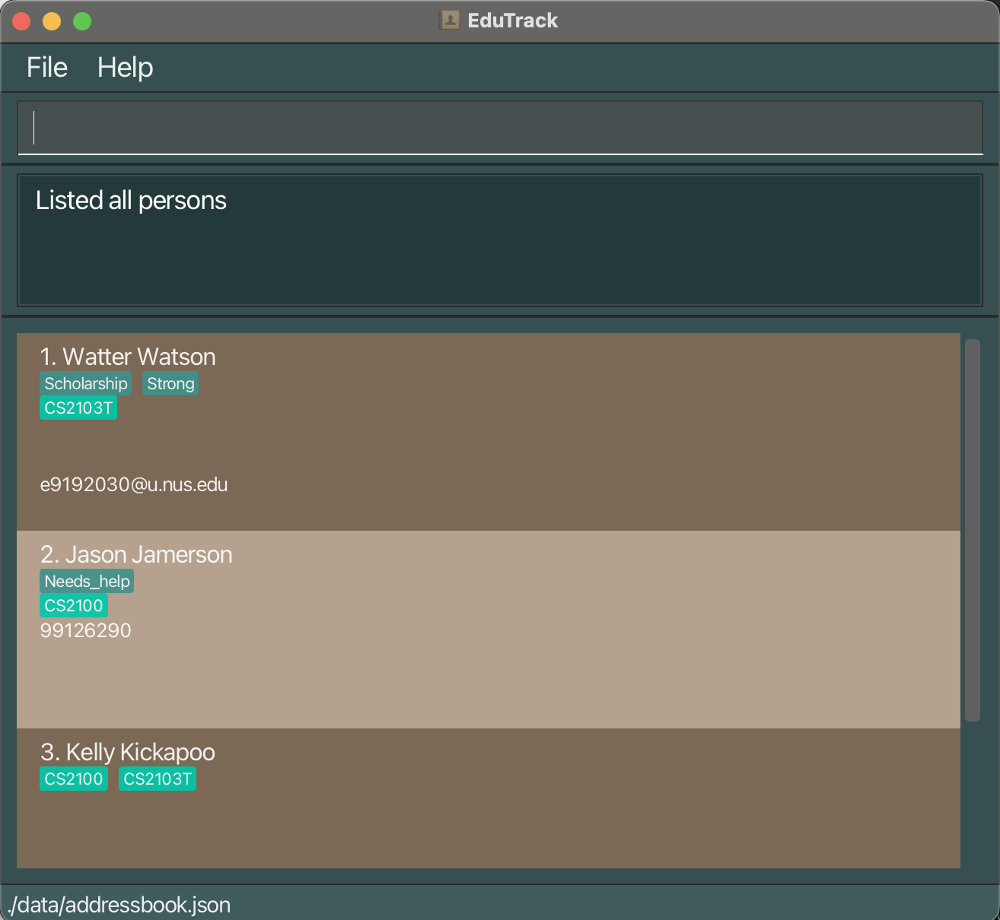

# EduTrack User Guide
**EduTrack** is a classroom management system.

It allows you to manage your students on your desktop with keyboard commands.
 

#### Why should you use it?
If you type fast, you can handle and manage all your students across your different classes faster than traditional GUI apps, using EduTrack!
 

## Table of Contents

* [Quick start](#quick-start)
* [Features](#features)
  * [Commands](#commands)
      * [Help page: `help`](#help-page-help)
      * [Adding a person: `add`](#adding-a-person-add)
      * [Listing all persons : `list`](#listing-all-persons-list)
      * [Editing a person : `edit`](#editing-a-person-edit)
      * [Locating by name or group: `find`](#locating-by-name-or-group-find)
      * [Locating by tag: `findtag`](#locating-by-tag-findtag)
      * [Deleting a person : `delete`](#deleting-a-person--delete)
      * [Clearing all persons : `clear`](#clearing-all-persons--clear)
      * [Exiting the program : `exit`](#exiting-the-program--exit)
      * [Create Group: `group/create`](#create-group-groupcreate)
      * [Delete Group: `group/delete`](#delete-group-groupdelete)
      * [List Groups: `group/list`](#list-groups-grouplist)
      * [Assign Group: `group/assign`](#assign-group-groupassign)
      * [Unassign Group: `group/unassign`](#unassign-group-groupunassign)
      * [Create Tag: `tag/create`](#create-tag-tagcreate)
      * [Delete Tag: `tag/delete`](#delete-tag-tagdelete)
      * [List Tags: `tag/list`](#list-tags-taglist)
      * [Assign Tag: `tag/assign`](#assign-tag-tagassign)
      * [Unassign Tag: `tag/unassign`](#unassign-tag-tagunassign)
      * [Stats: `stats`](#unassign-tag-tagunassign)
      * [Sorting: `sort`](#unassign-tag-tagunassign)
      * [Create note: `note/create`](#unassign-tag-tagunassign)
      * [Delete note: `note/delete`](#unassign-tag-tagunassign)
  * [Other functionality](#other-functionality)
    * [Saving the data](#saving-the-data)
    * [Editing the data file](#editing-the-data-file)
    * [Archiving data files `[coming in v2.0]`](#archiving-data-files-coming-in-v20)
* [FAQ](#faq)
* [Known issues](#known-issues)
* [Command summary](#command-summary)

--------------------------------------------------------------------------------------------------------------------

## Quick start

1. Ensure you have Java `17` or above installed in your Computer. 
   **Mac users:** Ensure you have the precise JDK version prescribed [here](https://se-education.org/guides/tutorials/javaInstallationMac.html).

2. Download the latest `.jar` file from [here](https://github.com/AY2526S1-CS2103T-F14a-3/tp/releases).

3. Save the file to the folder you want to use to store all files related to EduTrack.

4. Open a command terminal
   >* **Mac** / **Linux** users: search for 'Terminal'
   >* **Windows** users: search for 'Command Prompt'

5. Enter the command `cd <FOLDER>` where you replace <FOLDER> with the folder name that you saved the jar file to

6. Enter the command `java -jar edutrack.jar` to run the application. 
   Your screen should have a window pop up that looks like this below:

    The data you see here is the sample data that comes with the app.

7. To do things in EduTrack, you have to type in certain commands into the main command box, and hit Enter.
     Refer to the [Features](#features) below for the details of all commands that you can use.
     You may also refer to the [Command summary](#Command-summary) below for a summary table of all possible commands.

--------------------------------------------------------------------------------------------------------------------

 

 

## Features

--------------------------------------------------------------------------------------------------------------------
## Commands

**:information_source: Notes about how to understand the command formats in the guide:** 

* You have to replace parameters in upper case with the actual values you want 
  > e.g. in `add n/NAME`, `NAME` is to be replaced with the actual name to be used, such as `add n/John Doe`.

* You can choose not to include parameters in square brackets. 
  > e.g `n/NAME [t/TAG]` can be used as `n/John Doe t/friend` or as `n/John Doe`.

* If you see parameters with `…`​ after them, you can use them multiple times, or not at all. 
  > e.g. `[t/TAG]…​` can be used as ` ` (i.e. 0 times), `t/friend`, `t/friend t/family` etc.

* You can type the parameters in any order, as long as you put the correct prefix 
  > e.g. if the command specifies `n/NAME p/PHONE_NUMBER`,
  > you can also type `p/PHONE_NUMBER n/NAME`.

* If you are using a PDF version of this document, be careful when copying and pasting commands directly.
    * This is because you may accidentally copy over hidden invalid characters.

### Help page: `help`

Shows a message explaining how to access the help page.

Format: `help`

#### Notes:
> - You may use the keyboard shortcut `F1` to access the help window too.

--------------------------------------------------------------------------------------------------------------------
### Adding a person: `add`

Adds a person to the address book.

Format: `add n/NAME [p/PHONE_NUMBER] [e/EMAIL] [a/ADDRESS] [g/GROUP]…`

#### Notes:

> + All specified groups and tags must already exist in the system.
> + Groups and tags must follow their respective naming conventions (see [group/create](#create-group-groupcreate) and [tag/create](#create-tag-tagcreate) for details).
> + Duplicate persons are not allowed in the address book. A duplicate is defined as a person with the same name as an existing person (case-insensitive). 

#### Example usage:
* `add n/John Doe`
* `add n/Chee Hin g/CS2103T-F14a`
* `add n/Kevin p/91234567 e/kevin@outlook.com a/123 Baker St g/CS2103T-F14a`

--------------------------------------------------------------------------------------------------------------------

### Listing all persons: `list`

Shows a list of all persons in the address book.

Format: `list`

--------------------------------------------------------------------------------------------------------------------
### Editing a person: `edit`

Edits an existing person in the address book.

Format: `edit INDEX [n/NAME] [p/PHONE] [e/EMAIL] [a/ADDRESS] [g/GROUP]…​`

#### Notes:
>* Edits the person at the specified `INDEX`. The index refers to the index number shown in the displayed person list. The index **must be a positive integer** 1, 2, 3, …​
>* At least one of the optional fields must be provided.
>* Existing values will be updated to the input values.
>* To manage tags, use the `tag/assign` and `tag/unassign` commands instead.

**Important: Editing Groups**

* When editing groups, the existing groups of the person will be removed

  i.e if you wish to edit a student that already has group `CS2103T`, you have to include `CS2103T` again if you wish to keep it.
* You can remove all the person's groups by typing `g/` without specifying any groups after it.

Examples:
*  `edit 1 p/91234567 e/johndoe@example.com` Edits the phone number and email address of the 1st person to be `91234567` and `johndoe@example.com` respectively.
*  `edit 2 n/Betsy Crower t/` Edits the name of the 2nd person to be `Betsy Crower` and clears all existing tags.
*  `edit 2 n/Betsy Crower g/` Edits the name of the 2nd person to be `Betsy Crower` and clears all existing groups.

--------------------------------------------------------------------------------------------------------------------
### Locating by name or group: `find`

Find persons by name or by group. 
You must choose exactly one of the two forms below.

Format (choose ONE):

By name: `find n/ KEYWORD [MORE_KEYWORDS]...`

By group: `find g/ GROUP_NAME [MORE_GROUPS]...`

#### Notes:
>* Exactly one of n/ or g/ must be present.
>* Keywords/Group names are separated by spaces
>* The search is case-insensitive. e.g `hans` will match `Hans`
>* The order of the keywords does not matter. e.g. `Hans Bo` will match `Bo Hans`
>* Name search matches full words in the person’s name. e.g. `Han` will not match `Hans`
>* Group search matches group names assigned to the person.
>* Persons matching at least one keyword will be returned (i.e. `OR` search).
   e.g. `Hans Bo` will return `Hans Gruber`, `Bo Yang`

#### Examples:
* `find n/ John` returns `john` and `John Doe`
* `find n/ alex david` returns `Alex Yeoh`, `David Li` 
  

* `find g/CS2103T` returns all persons in group “CS2103T”
* `find g/CS1101S CS1231S` returns all persons in groups “CS1101S” or "CS1231S"

--------------------------------------------------------------------------------------------------------------------

### Locating by tag: `findtag`

Finds students who have the specified tag.

Format: `findtag t/TAG`

#### Notes:
>* The search is case-insensitive. e.g. `t/friends` will match persons with tag `Friends`
>* Only one tag can be searched at a time.
>* Only persons with the exact tag will be returned.
>* Tag names may include alphanumeric characters, hyphens (-), underscores (_), and slashes (/).

#### Examples:
* `findtag t/friends` returns all persons tagged with `friends`
* `findtag t/needs_help` returns all persons tagged with `needs_help`
* `findtag t/CS2103T/W13` returns all persons tagged with `CS2103T/W13`

--------------------------------------------------------------------------------------------------------------------

### Deleting a person : `delete`

Deletes the specified person from the address book.

Format: `delete INDEX`

#### Notes:
>* Deletes the person at the specified `INDEX`.
>* The index refers to the index number shown in the displayed person list.
>* The index **must be a positive integer** 1, 2, 3, …​

#### Examples:
* `list` followed by `delete 2` deletes the 2nd person in the address book.
* `find Betsy` followed by `delete 1` deletes the 1st person in the results of the `find` command.
   

--------------------------------------------------------------------------------------------------------------------
### Clearing all persons : `clear`

Clears all the data in EduTrack.

Format: 
- `clear` (on first use)
- `clear confirm` (after already typing `clear` once and hitting 'Enter')

#### Notes:
> - The clear command clears all data, including people, groups, tags.
> - After you type `clear`, you have to type `clear confirm` to complete the clear
> - If you try to type `clear confirm` before having typed `clear` at least once, you will be prompted to first initiate the clear
> - After you type `clear`, if you type anything else other than `clear confirm`, it resets the clearing workflow and you have to start over.

--------------------------------------------------------------------------------------------------------------------
### Exiting the program : `exit`

Exits the program.

Format: `exit`

--------------------------------------------------------------------------------------------------------------------

### Create Group: `group/create`

Creates a new group with a specified name.

Format:

`group/create g/GROUP_NAME`

>* `GROUP_NAME` refers to the name you wish to assign to the group.
>* `GROUP_NAME` is case-insensitive and acceptable characters are alphanumeric.​
>* `GROUP_NAME` has a maximum length of 100 characters.​
>* Spaces are not allowed.

--------------------------------------------------------------------------------------------------------------------
### Delete Group: `group/delete`

Deletes an existing group and removes all group assignments from associated contacts.

Format:

`group/delete g/GROUP_NAME`

--------------------------------------------------------------------------------------------------------------------
### List Groups: `group/list`

Displays all existing groups.

Format:

`group/list`

--------------------------------------------------------------------------------------------------------------------
### Assign Group: `group/assign`

Assigns a group to one or more existing contacts.

Format: `group/assign INDEX [MORE_INDEXES...] g/GROUP_NAME`

#### Notes:
> * The indices refer to the index numbers shown in the displayed person list.
> * The indices **must be positive integers** 1, 2, 3, …​
> * Only one group can be assigned in each command.
> * If the specified group does not exist, EduTrack will prompt you to create it first using `group/create.`

#### Examples:
> * `group/assign 1 g/CS2103T` assigns the group `CS2103T` to the 1st person in the list.
> * `group/assign 2 3 5 g/CS2040S` assigns the group `CS2040S` to the 2nd, 3rd, and 5th persons in the list.

--------------------------------------------------------------------------------------------------------------------
### Unassign Group: `group/unassign`

Removes a group from one or more contacts.

Format: `group/unassign INDEX [MORE_INDEXES...] g/GROUP_NAME`

#### Notes:
> * The indices refer to the index numbers shown in the displayed person list.
> * The indices **must be positive integers** 1, 2, 3, …​
> * Only one group can be unassigned in each command.
> * The specified group must exist in the system.

#### Examples:
> * `group/unassign 1 g/CS2103T` removes the group `CS2103T` from the 1st person in the list.
> * `group/unassign 2 3 g/CS2040S` removes the group `CS2040S` from the 2nd and 3rd persons in the list.

--------------------------------------------------------------------------------------------------------------------

### Create Tag: `tag/create`

Creates a new tag with a specified name.

Format: `tag/create t/TAG_NAME`

#### Notes:
>* `TAG_NAME` refers to the name you wish to assign to the tag.
>* `TAG_NAME` is case-insensitive and acceptable characters are alphanumeric, hyphens (-), underscores (_), and slashes (/).
>* `TAG_NAME` has a maximum length of 100 characters.​
>* Spaces are not allowed.

--------------------------------------------------------------------------------------------------------------------
### Delete Tag: `tag/delete`

Deletes an existing tag and removes all tag assignments from associated contacts.

Format: `tag/delete t/TAG_NAME`

--------------------------------------------------------------------------------------------------------------------
### List Tags: `tag/list`

Displays all existing tags.

Format: `tag/list`

--------------------------------------------------------------------------------------------------------------------
### Assign Tag: `tag/assign`

Assigns an existing tag to a specified contact.

If the specified tag does not exist, EduTrack will prompt you to create it first using `tag/create`.

Format: `tag/assign INDEX t/TAG_NAME`

#### Notes:
> * Assigns the tag `TAG_NAME` to the contact at the specified `INDEX`.
> * The index refers to the index number shown in the displayed person list.
> * The index **must be a positive integer** 1, 2, 3, …​
> * The tag must already exist in the system.

#### Examples:
> * `tag/assign 1 t/needs_help` assigns the tag `needs_help` to the 1st person in the list.
> * `tag/assign 3 t/weak` assigns the tag `weak` to the 3rd person in the list.

--------------------------------------------------------------------------------------------------------------------
### Unassign Tag: `tag/unassign`

Unassigns an existing tag from a specified contact.

Format: `tag/unassign INDEX t/TAG_NAME`

#### Notes:
> * Removes the tag `TAG_NAME` from the contact at the specified `INDEX`.
> * The index refers to the index number shown in the displayed person list.
> * The index **must be a positive integer** 1, 2, 3, …​
> * The tag must currently be assigned to the person.

#### Examples
> * `tag/unassign 1 t/needs_help` removes the tag `needs_help` from the 1st person in the list.
> * `tag/unassign 3 t/weak` removes the tag `weak` from the 3rd person in the list.

--------------------------------------------------------------------------------------------------------------------
### Viewing Statistics: `stats`

Displays comprehensive statistics about your students and groups.

Format: `stats`

#### Notes:
> - The statistics window displays information in two main sections:
>   - **Total Stats** - Overview of all students
>     - Total number of students
>     - Total unique tags in use
>     - Breakdown of each tag and how many students have it
>   - **Group Stats** - Breakdown by tutorial group
>     - For each group, displays:
>       - Group name (e.g., CS2103T, CS2100)
>       - Number of students in the group
>       - Number of unique tags used in the group
>       - Breakdown of each tag and how many students in that group have it
> - Use this command to quickly identify which groups need more attention or to see tag distribution across your students.

--------------------------------------------------------------------------------------------------------------------

### Sorting: `sort`

Sorts all students by their names in alphabetical order.

Format: `sort`

#### Notes:
> * Sorting is case-insensitive
> * The order is ascending
> * Sorting always applies to the full student list rather than the current filtered view.
> * Sorting will reset the view to show all students instead of only the filtered results.

--------------------------------------------------------------------------------------------------------------------

### Create notes: `note/create`

Creates a note for a student. Each student can have only one note attached.

Format: `note/create INDEX no/NOTE_CONTENT`

#### Notes:
> PLACEHOLDER

--------------------------------------------------------------------------------------------------------------------

### Delete notes: `note/delete`

Deletes the note attached to a student. This command does nothing if the student has no note attached.

Format: `note/delete INDEX`

#### Notes:
> PLACEHOLDER

--------------------------------------------------------------------------------------------------------------------

## Other functionality

### Saving the data

EduTrack data are saved automatically to your computer after any command that changes the data.

There is no need to save manually.

--------------------------------------------------------------------------------------------------------------------

### Editing the data file

EduTrack data are saved automatically as a JSON file at this file location:
`[JAR file location]/data/edutrack.json`.

Advanced users are welcome to update data directly by editing that data file.

 :exclamation:  **Caution**  For ADVANCED users:
If your changes to the data file makes its format invalid, Edutrack will discard all data and start with an empty data file at the next run. Hence, it is recommended to take a backup of the file before editing it. 
Furthermore, certain edits can cause the EduTrack to behave in unexpected ways (e.g., if a value entered is outside of the acceptable range). Therefore, edit the data file only if you are confident that you can update it correctly.

--------------------------------------------------------------------------------------------------------------------

### Archiving data files `[coming in v2.0]`

_Details coming soon ..._

--------------------------------------------------------------------------------------------------------------------

## FAQ

**Q**: How do I transfer my data to another Computer? 
**A**: Install the app in the other computer and overwrite the empty data file it creates with the file that contains the data of your previous EduTrack home folder.

--------------------------------------------------------------------------------------------------------------------

## Known issues

1. **When using multiple screens**, if you move the application to a secondary screen, and later switch to using only the primary screen, the GUI will open off-screen.
   * The remedy is to delete the `preferences.json` file created by the application before running the application again.

--------------------------------------------------------------------------------------------------------------------

## Command Summary

| Action                  | Description                                 | Format / Example                                                                                                                                                  |
|-------------------------|---------------------------------------------|-------------------------------------------------------------------------------------------------------------------------------------------------------------------|
| **Add**                 | Add a person to the list.                   | `add n/NAME [p/PHONE_NUMBER] [e/EMAIL] [a/ADDRESS] [g/GROUP]…`      Example: `add n/James Ho p/22224444 e/jamesho@example.com a/123, Clementi Rd g/CS2103T` |
| **Clear**               | Removes all stored data.                    | `clear`                                                                                                                                                           |
| **Delete**              | Deletes contact from EduTrack.              | `delete INDEX`  Example: `delete 3`                                                                                                                         |
| **Edit**                | Edit an existing contact.                   | `edit INDEX [n/NAME] [p/PHONE] [e/EMAIL] [a/ADDRESS] [g/GROUP]…​`    Example: `edit 2 n/James Lee e/jameslee@example.com`                                   |
| **Find**                | Locate persons by keywords in their names.  | `find KEYWORD [MORE_KEYWORDS]`  Example: `find James Jake`                                                                                                  |
| **Find by Group**       | Find all contacts in a specific group.      | `find g/GROUP`  Example: `find g/CS2103T`                                                                                                                   |
| **Find by Tag**         | Find contacts with a specific tag.          | `findtag t/TAG`  Example: `findtag t/friends`                                                                                                               |
| **Create Group**        | Make a new group.                           | `group/create g/GROUP`  Example: `group/create g/CS2103T`                                                                                                   |
| **Delete Group**        | Remove an existing group.                   | `group/delete g/GROUP`  Example: `group/delete g/CS2103T`                                                                                                   |
| **Assign to Group**     | Assign contacts to a group.                 | `group/assign INDEX [MORE_INDEXES...] g/GROUP_NAME`  Example: `group/assign 1 2 g/CS2103T`                                                                   |
| **Unassign from Group** | Remove contacts from a group.               | `group/unassign INDEX [MORE_INDEXES...] g/GROUP_NAME`  Example: `group/unassign 1 2 g/CS2103T`                                                             |
| **List Group**          | Show all existing groups.                   | `group/list`                                                                                                                                                      |
| **Create Tag**          | Make a new tag.                             | `tag/create t/TAG`  Example: `tag/create t/needs_help`                                                                                                      |
| **Delete Tag**          | Remove an existing tag.                     | `tag/delete t/TAG`  Example: `tag/delete t/needs_help`                                                                                                      |
| **Assign Tag**          | Assign a tag to a contact.                  | `tag/assign INDEX t/TAG_NAME`  Example: `tag/assign 1 t/needs_help`                                                                                         |
| **Unassign Tag**        | Remove a tag from a contact.                | `tag/unassign INDEX t/TAG_NAME`  Example: `tag/unassign 1 t/needs_help`                                                                                     |
| **List Tag**            | Show all existing tags.                     | `tag/list`                                                                                                                                                        |
| **Stats**               | Show all student statistics.                | `stats`                                                                                                                                                           |
| **List**                | Show all contacts.                          | `list`                                                                                                                                                            |
| **Help**                | Display help information.                   | `help`                                                                                                                                                            |
| **Sort**                | Sort all students alphabetically.           | `sort`                                                                                                                                                            |
| **Create Note**         | Creates a note for specified student.       | `note/create INDEX no/NOTE`  Example: `note/create 3 no/Missed the past 3 deadlines. Needs more help with CS2100.`                                           |
| **Delete Note**         | Deletes note attached to specified student. | `note/delete INDEX`  Example: `note/delete 3`                                                                                                               |

